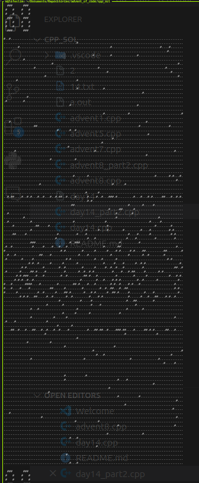

for compiling and then executing each file use one of the following methods

method 1 to keep things organized
```bash
g++ advent1.cpp -o advent1
./advent1
```

method 2 if order does not matter
```bash
g++ advent1.cpp
./a.out
```


after day 14 do:
```bash
g++ day14.cpp -o day14
./day14 < input.txt
```

day 14.2 does not work, I don't know why,
 this looks like a tree to me